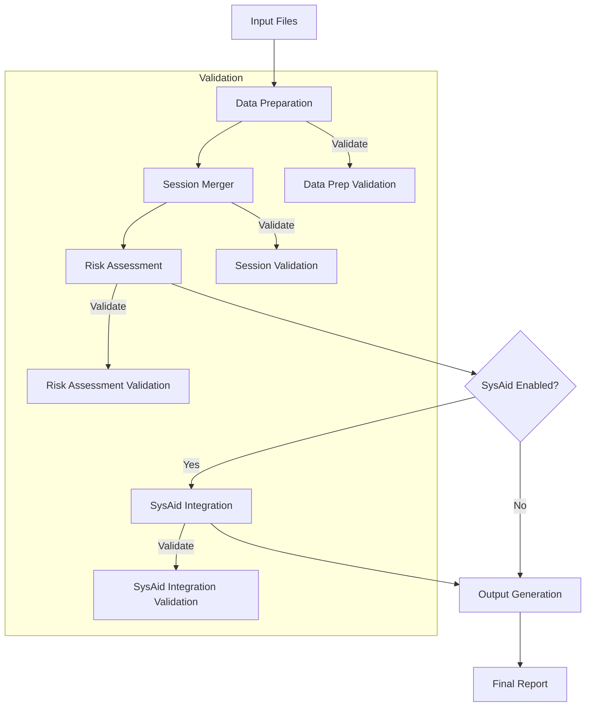

# SAP Audit Controller Design

## Overview

The SAP Audit Controller (`sap_audit_controller.py`) is a central orchestration module that coordinates the entire SAP audit workflow. It connects all refactored components into a cohesive pipeline, manages workflow execution, and provides a unified interface for running the audit process. This document explains the design choices, implementation details, and how to use the controller.

## Key Features

1. **Pipeline Architecture**: Implements a pipeline architecture that connects data preparation, session merging, risk assessment, SysAid integration, and output generation.

2. **Centralized Configuration**: Validates and manages configuration parameters for all modules.

3. **Progress Tracking**: Implements comprehensive progress tracking throughout the audit process.

4. **Error Handling**: Provides a unified error handling system that maintains process integrity.

5. **Operational Modes**: Supports different operational modes (full audit, data prep only, etc.)

6. **Validation Between Steps**: Ensures data consistency and integrity between processing stages.

## Class Structure

### AuditController

The central controller class that orchestrates the entire audit workflow.

```python
class AuditController:
    """
    Main controller class that orchestrates the entire audit workflow.
    """
    
    def __init__(self, config=None):
        """Initialize controller with optional config override."""
        self.config = config or {}
        
        # Initialize components
        self.data_prep = DataPrepManager()
        self.session_merger = SessionMerger()
        self.risk_assessor = RiskAssessor()
        self.sysaid_integrator = SysAidIntegrator()
        self.output_generator = OutputGenerator()
        
    def run_full_audit(self):
        """
        Run the complete audit process from data prep to output.
        
        Returns:
            bool: Success status
        """
        log_section("Starting Full SAP Audit")
        
        # Step 1: Data preparation
        if not self.run_data_preparation():
            log_message("Data preparation failed, cannot continue", "ERROR")
            return False
            
        # Step 2: Session merging
        session_df = self.run_session_merging()
        if session_df is None:
            log_message("Session merging failed, cannot continue", "ERROR")
            return False
            
        # Step 3: Risk assessment
        session_df = self.run_risk_assessment(session_df)
        if session_df is None:
            log_message("Risk assessment failed", "ERROR")
            return False
            
        # Step 4: SysAid integration
        session_df = self.run_sysaid_integration(session_df)
        
        # Step 5: Output generation
        success = self.generate_output(session_df)
        
        if success:
            log_message("Full audit completed successfully")
        else:
            log_message("Audit completed with errors", "WARNING")
            
        return success
```

## Pipeline Architecture

The controller implements a sequential pipeline architecture where each step:

1. Takes input from the previous step
2. Performs its specific processing
3. Validates the results
4. Passes validated output to the next step

The pipeline design allows:
- Clear separation of concerns
- Easy addition of new processing steps
- Better visibility into process flow
- Reliable failure detection and handling

### Pipeline Flow Diagram



## Component Integration

The controller integrates all refactored components:

### 1. Data Preparation (`DataPrepManager`)

Responsible for:
- Finding input files
- Standardizing column names
- Creating datetime columns
- Saving processed files as CSV

Integration:
```python
def run_data_preparation(self):
    """Run data preparation step with validation."""
    log_section("Running Data Preparation")
    success = self.data_prep.process_input_files()
    
    if success:
        log_message("Data preparation completed successfully")
    else:
        log_message("Data preparation failed", "ERROR")
        
    return success
```

### 2. Session Merger (`SessionMerger`)

Responsible for:
- Loading processed data files
- Merging CDHDR and CDPOS data
- Creating a unified timeline
- Assigning session IDs

Integration:
```python
def run_session_merging(self):
    """
    Run session merger step with validation.
    
    Returns:
        DataFrame with session timeline or None if failed
    """
    log_section("Running Session Merger")
    
    merger = self.session_merger
    session_df = merger.create_timeline()
    
    if session_df is not None and not session_df.empty:
        log_message(f"Session merger completed with {len(session_df)} records")
        return session_df
    else:
        log_message("Session merger failed to create timeline", "ERROR")
        return None
```

### 3. Risk Assessment (`RiskAssessor`)

Responsible for:
- Evaluating risks based on various criteria
- Adding risk levels and descriptions
- Flagging suspicious activities

Integration:
```python
def run_risk_assessment(self, session_df):
    """
    Run risk assessment step with validation.
    
    Args:
        session_df: DataFrame with session timeline
        
    Returns:
        DataFrame with added risk assessments or None if failed
    """
    log_section("Running Risk Assessment")
    
    try:
        result_df = self.risk_assessor.assess_risk(session_df)
        
        if result_df is not None:
            # Validate risk levels exist
            if 'risk_level' in result_df.columns:
                log_message("Risk assessment results:")
                
                # Get risk distribution
                risk_counts = result_df['risk_level'].value_counts()
                for level, count in risk_counts.items():
                    log_message(f"  {level}: {count}")
                
                return result_df
            else:
                log_message("Risk assessment did not produce risk levels", "ERROR")
                return session_df  # Return original data as fallback
        else:
            log_message("Risk assessment failed", "ERROR")
            return None
            
    except Exception as e:
        log_error(e, "Error during risk assessment")
        return None
```

### 4. SysAid Integration (`SysAidIntegrator`)

Responsible for:
- Loading SysAid ticket data
- Enhancing session timeline with ticket info
- Linking SAP activities to tickets

Integration:
```python
def run_sysaid_integration(self, session_df):
    """
    Run SysAid integration step with validation.
    
    Args:
        session_df: DataFrame with session timeline and risk assessment
        
    Returns:
        DataFrame with added SysAid information or original if disabled/failed
    """
    # Check if SysAid integration is enabled
    if not self.config.get("enable_sysaid", True):
        log_message("SysAid integration is disabled in config, skipping")
        return session_df
        
    log_section("Running SysAid Integration")
    
    try:
        # Configure SysAid data source strategy
        data_source = self.config.get("sysaid_source", "file")
        integrator = self.sysaid_integrator
        
        # Enhance session timeline
        enhanced_df = integrator.enhance_session_timeline(session_df)
        
        if enhanced_df is not None:
            # Validate SysAid columns exist
            sysaid_column = SYSAID["output_column"]
            if sysaid_column in enhanced_df.columns:
                log_message("SysAid integration completed successfully")
                return enhanced_df
            else:
                log_message("SysAid integration did not add expected columns", "WARNING")
                return session_df
        else:
            log_message("SysAid integration failed", "ERROR")
            return session_df
            
    except Exception as e:
        log_error(e, "Error during SysAid integration")
        return session_df
```

### 5. Output Generation (`OutputGenerator`)

Responsible for:
- Creating formatted reports
- Adding visualizations
- Saving outputs in desired formats

Integration:
```python
def generate_output(self, session_df):
    """
    Generate output reports with validation.
    
    Args:
        session_df: DataFrame with session timeline, risks, and SysAid info
        
    Returns:
        bool: Success status
    """
    log_section("Generating Output")
    
    try:
        # Configure output format
        output_format = self.config.get("output_format", "excel")
        output_path = self.config.get("output_path")
        
        # Create appropriate output generator
        if output_format.lower() == "csv":
            generator = CSVOutputGenerator()
        else:
            generator = self.output_generator
            
        # Generate report
        success = generator.generate_report(session_df, output_path)
        
        if success:
            path = output_path or PATHS["audit_report"]
            log_message(f"Output generated successfully: {path}")
            return True
        else:
            log_message("Output generation failed", "ERROR")
            return False
            
    except Exception as e:
        log_error(e, "Error during output generation")
        return False
```

## Configuration Validation

The controller validates configuration at startup to ensure all components have valid settings:

```python
def validate_configuration(self):
    """
    Validate configuration settings for all components.
    
    Returns:
        bool: True if configuration is valid, False otherwise
    """
    log_message(f"Using configuration: {self.config}")
    
    try:
        # Check required paths exist
        for path_name, path_value in PATHS.items():
            if path_name.endswith("_dir") and not os.path.exists(path_value):
                os.makedirs(path_value)
                log_message(f"Created directory: {path_value}")
                
        # Validate risk thresholds
        risk_threshold = self.config.get("risk_threshold", {})
        if risk_threshold:
            levels = sorted(risk_threshold.values(), reverse=True)
            if len(levels) >= 2 and levels[0] <= levels[-1]:
                log_message("Warning: Risk thresholds are not in descending order", "WARNING")
                
        # Validate output format
        output_format = self.config.get("output_format", "excel")
        if output_format.lower() not in ["excel", "csv"]:
            log_message(f"Warning: Unsupported output format '{output_format}', using 'excel'", "WARNING")
            self.config["output_format"] = "excel"
            
        log_message("Configuration validation completed")
        return True
        
    except Exception as e:
        log_error(e, "Configuration validation error")
        return False
```

## Operational Modes

The controller supports multiple operational modes:

### 1. Full Audit

```python
# Run the complete audit process
controller = AuditController()
controller.run_full_audit()
```

### 2. Data Preparation Only

```python
# Run only the data preparation step
controller = AuditController()
controller.run_data_preparation()
```

### 3. Custom Pipeline

```python
# Define a custom audit pipeline
controller = AuditController()

# Run steps individually
if controller.run_data_preparation():
    session_df = controller.run_session_merging()
    if session_df is not None:
        # Skip risk assessment
        session_df = controller.run_sysaid_integration(session_df)
        controller.generate_output(session_df)
```

### 4. Custom Configuration

```python
# Custom configuration
custom_config = {
    "output_format": "csv",
    "enable_sysaid": False,
    "output_path": "C:/Custom/Path/audit_report.csv"
}

# Create controller with custom config
controller = AuditController(config=custom_config)
controller.run_full_audit()
```

## Command-Line Interface

The controller supports a command-line interface for flexible usage:

```python
def parse_arguments():
    """Parse command-line arguments."""
    parser = argparse.ArgumentParser(description="SAP Audit Tool")
    
    parser.add_argument("--mode", choices=["full", "data-prep", "merge", "assess", "report"],
                      default="full", help="Operating mode")
    
    parser.add_argument("--format", choices=["excel", "csv"],
                      default="excel", help="Output format")
    
    parser.add_argument("--output", type=str,
                      help="Output file path")
    
    parser.add_argument("--no-sysaid", action="store_true",
                      help="Disable SysAid integration")
    
    return parser.parse_args()
```

## Error Handling and Reporting

The controller implements comprehensive error handling:

1. **Cascading Failures**: If a critical step fails, dependent steps are skipped.
2. **Graceful Degradation**: Non-critical failures allow the process to continue.
3. **Detailed Error Logging**: All errors are logged with context and timestamps.
4. **Error Summaries**: A summary of errors is provided at the end of processing.

## Progress Tracking

The controller tracks progress throughout the audit:

1. **Step Completion**: Each step reports its completion status.
2. **Record Counts**: Record counts are logged between steps.
3. **Step Timing**: Processing time for each step is measured and reported.
4. **Overall Progress**: Overall audit progress is tracked and reported.

## Integration Testing

An integration testing module (`test_sap_audit_integration.py`) verifies the complete workflow:

1. **End-to-End Testing**: Tests the entire pipeline with sample data.
2. **Component Interaction**: Verifies correct handoff between components.
3. **Error Handling**: Tests error conditions and recovery.
4. **Performance Benchmarking**: Measures performance of each step.

```python
def test_full_audit_workflow():
    """Test the complete audit workflow with sample data."""
    # Create sample input files
    create_sample_input_files()
    
    # Create controller
    controller = AuditController()
    
    # Run full audit
    success = controller.run_full_audit()
    
    # Verify success
    assert success, "Full audit should complete successfully"
    
    # Verify output file exists
    assert os.path.exists(PATHS["audit_report"]), "Output file should exist"
    
    # Verify report content
    # (Additional verification steps)
```

## Future Enhancements

1. **Parallel Processing**: Enable parallel processing for independent steps.
2. **Real-time Monitoring**: Add real-time monitoring of audit progress.
3. **Web Interface**: Create a web interface for audit management.
4. **Scheduling**: Add scheduling capabilities for automated audits.
5. **REST API**: Implement a REST API for programmatic access.

## Conclusion

The SAP Audit Controller provides a robust, flexible, and maintainable architecture for orchestrating the SAP audit process. By centralizing workflow management, validating configuration, and providing comprehensive error handling, it ensures reliable execution of the audit pipeline and enables easy extension with new features and processing steps.
