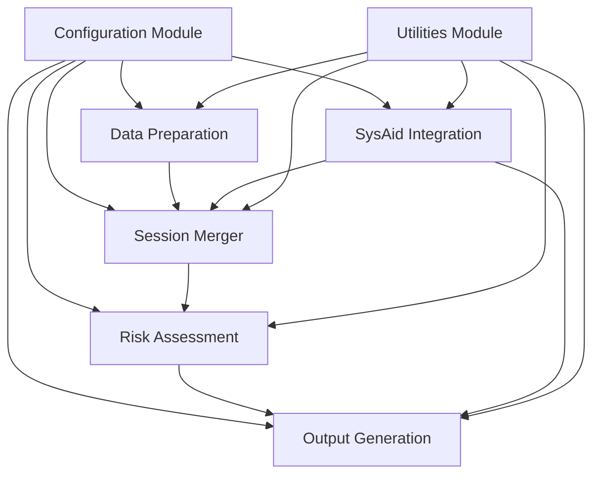

# SAP Audit Tool Architecture

## Overview

The SAP Audit Tool is a Python-based system designed to analyze SAP log files for security and audit purposes. The tool processes logs from multiple SAP sources (SM20, CDHDR, CDPOS), combines them into a unified session timeline, performs risk assessments, and generates reports.

This document outlines the architecture of the tool, highlighting key components, data flows, and design decisions. It serves as a reference for maintaining and extending the system with an emphasis on clarity and maintainability for monthly usage.

## Key Components

The architecture follows a modular design with clear separation of concerns:

### 1. Configuration Module (`sap_audit_config.py`)

The Configuration Module centralizes all settings and parameters used throughout the application. It serves as a single source of truth for:

- File paths and directory locations
- Column name mappings for different data sources
- Processing settings and thresholds
- Version information

**Benefits:**
- Eliminates hardcoded values scattered throughout the code
- Provides clear documentation of all configuration parameters
- Makes it easy to update settings without modifying multiple files
- Ensures consistency across all modules

### 2. Utilities Module (`sap_audit_utils.py`)

The Utilities Module provides common functions used across all components including:

- Logging with multiple output targets (console and file)
- Standardized error handling
- Data validation and transformation
- File operations
- Formatting functions

**Benefits:**
- Consistent error handling and logging throughout the application
- Reduces code duplication
- Provides robust default behaviors for common operations
- Improves readability by moving utility code out of business logic

### 3. Data Preparation (`sap_audit_data_prep.py`)

Responsible for:
- Finding and loading input files
- Standardizing column names
- Cleaning data (whitespace, NaN values)
- Creating datetime columns from date and time fields
- Validating data quality
- Saving processed files as CSV

### 4. Session Merger (`SAP Log Session Merger.py`)

Responsible for:
- Combining data from multiple sources (SM20, CDHDR, CDPOS)
- Assigning session IDs based on SysAid tickets or user+date
- Creating a unified chronological view of user activity
- Generating an Excel output with color-coding by source

### 5. Risk Assessment (`sap_audit_risk_core.py`)

Responsible for:
- Applying risk classification rules to session data
- Detecting patterns of suspicious activity
- Identifying high-risk transactions and fields
- Generating risk levels and descriptions

### 6. SysAid Integration (`sap_audit_sysaid.py`)

Responsible for:
- Loading SysAid ticket information
- Standardizing ticket references
- Correlating sessions with change tickets
- Providing context for user activity

### 7. Output Generation (`sap_audit_tool_output.py`)

Responsible for:
- Creating formatted Excel reports
- Generating summary statistics
- Adding visualizations and conditional formatting
- Providing clear risk assessment results

## Data Flow

The typical data flow through the system is as follows:

1. **Data Preparation**:
   - Input files are located and loaded
   - Column names are standardized
   - Data is cleaned and validated
   - Processed files are saved as CSV

2. **Session Merger**:
   - Processed CSV files are loaded
   - Data is combined into a unified timeline
   - Session IDs are assigned
   - Timeline is saved as Excel

3. **Risk Assessment**:
   - Session timeline is loaded
   - Risk assessment rules are applied
   - Sessions are categorized by risk level
   - Risk descriptions are generated

4. **Output Generation**:
   - Risk-assessed data is formatted
   - Summary statistics are calculated
   - Final report is generated with formatting
   - Archive copies are stored if needed

## Error Handling Strategy

The architecture implements a robust error handling strategy:

1. **Consistent Logging**:
   - All errors are logged with timestamps and context
   - Detailed stack traces in DEBUG mode
   - Clear user-friendly messages for runtime errors

2. **Graceful Degradation**:
   - System attempts to continue processing when possible
   - Clear reporting of partial processing
   - Default values provided when data is missing

3. **Validation Checks**:
   - Input validation before processing begins
   - Record count validation between processing steps
   - Schema validation for required columns
   - Data quality checks (null values, duplicates)

4. **Recovery Mechanisms**:
   - Caching of intermediate results
   - Ability to restart from specific points
   - Detection of incomplete previous runs

## Configuration Management

All configuration is centralized in `sap_audit_config.py` which provides:

1. **File Paths**:
   - Input/output directories
   - Default file locations
   - Cache file paths

2. **Column Mappings**:
   - SM20, CDHDR, CDPOS column names
   - Standardized output column names
   - SysAid field mappings

3. **Processing Settings**:
   - Field exclusion lists
   - Data format specifications
   - Validation thresholds

4. **Version Information**:
   - Version number
   - Release date
   - Feature list

## Monthly Run Procedure

The tool is designed for monthly use with the following procedures:

1. **Preparation**:
   - Place new SAP export files in the input directory
   - Files should follow naming patterns (`*_sm20_*.xlsx`, etc.)
   - Ensure SysAid export is available if ticket correlation is needed

2. **Execution**:
   - Run `sap_audit_tool.py` script
   - The tool automatically finds input files, processes them, and generates the report
   - Progress and status messages are displayed in the console
   - Detailed logs are written to the logs directory

3. **Verification**:
   - Check the console output for any warnings or errors
   - Verify record counts in the summary
   - Ensure all expected data sources are included
   - Review the log file for any issues

4. **Review Results**:
   - Open the generated Excel report
   - Review high and medium risk items
   - Check session information for completeness
   - Verify SysAid ticket correlations

## Maintenance and Extensibility

The modular architecture supports easy maintenance and extensions:

1. **Adding New Data Sources**:
   - Update `sap_audit_config.py` with new column mappings
   - Add a new processing function in `sap_audit_data_prep.py`
   - Update the session merger to incorporate the new data source

2. **Modifying Risk Rules**:
   - Risk assessment logic is isolated in `sap_audit_risk_core.py`
   - New detectors can be added to `sap_audit_detectors.py`
   - Reference data can be updated in `sap_audit_reference_data.py`

3. **Enhancing Output**:
   - Output formatting is contained in `sap_audit_tool_output.py`
   - New report types can be added as separate functions
   - Excel formatting can be modified in one location

4. **Updating SysAid Integration**:
   - SysAid handling is isolated in `sap_audit_sysaid.py`
   - Field mappings can be updated in `sap_audit_config.py`
   - New ticket correlation logic can be added without affecting other components

## Performance Considerations

While performance is not critical for a monthly-run tool, the following optimizations are included:

1. **Efficient Data Processing**:
   - Dataframe operations are optimized where possible
   - Memory usage is managed through targeted column selection
   - Large files are processed in chunks when needed

2. **Caching Mechanisms**:
   - Intermediate results are cached to avoid reprocessing
   - Reference data is loaded once and reused
   - Session-to-ticket mappings are cached for reuse

3. **Progress Reporting**:
   - Long-running operations provide progress updates
   - Time estimates are provided for multi-step processes
   - Performance statistics are logged for monitoring

## Best Practices for Development

When extending or modifying the tool, follow these best practices:

1. **Documentation**:
   - All functions must have clear docstrings
   - Complex logic should include inline comments
   - Update this architecture document for significant changes

2. **Error Handling**:
   - Use the `handle_exception` decorator for new functions
   - Log all errors with appropriate context
   - Provide user-friendly error messages

3. **Validation**:
   - Add input validation to new functions
   - Verify data quality between processing steps
   - Check record counts to detect data loss

4. **Testing**:
   - Test changes with representative data
   - Verify results against expected outcomes
   - Check for unexpected side effects

5. **Configuration**:
   - Add new settings to `sap_audit_config.py`
   - Never hardcode values in business logic
   - Document the purpose and options for new settings

## Conclusion

The SAP Audit Tool architecture prioritizes clarity, maintainability, and robustness for monthly operation. By centralizing configuration, standardizing error handling, and establishing clear component boundaries, the system is designed to be easy to understand and maintain even with infrequent use.

The documentation-first approach ensures that future users and developers can quickly understand the system's operation and make necessary changes with confidence.
